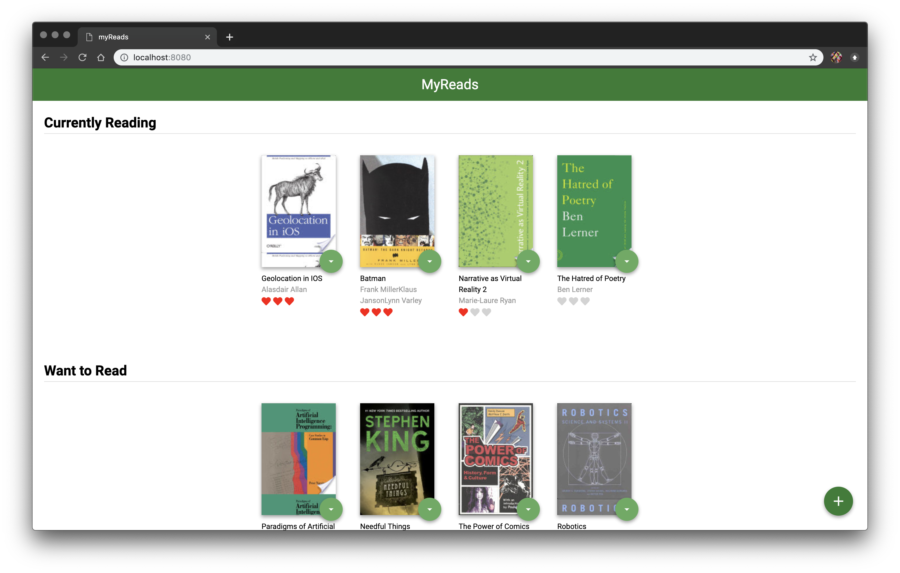

# MyReads

This is my final assessment project for Udacity's React Fundamentals course.

MyReads is a bookcase application that allows you to select and sort the books you have read, are reading or want to read. The project emphasizes using React to build the application and provides an API server and client library that is used to store information as the user interacts with the application.

I chose to build this project from scratch using React, Webpack, Babel, ESlint, instead of using plain Create React App.

## 👀 Screenshots




## 🚀 Quick start

1. Download the project and cd into it:

```
git clone https://github.com/junagao/myreads.git
cd myreads
```

2. Install dependencies and run the application:

```
yarn install
yarn start
```

3. Open your browser and navigate:

  http://localhost:3000

## 🧐 What's inside?

### Features (Requirements)

* Display 3 book shelves:
  * Currently Reading
  * Want to Read
  * Read
* List books categorized by shelf
* Shelf Update
* Search Page (*)

(*) In the search page (/search), you can get the list of books as by your input keywords. The backend API uses a fixed set of cached search results and is limited to a particular set of search terms, which can be found in [SEARCH_TERMS.md](SEARCH_TERMS.md). That list of terms are the _only_ terms that will work with the backend, so don't be surprised if your searches for Basket Weaving or Bubble Wrap don't come back with any results.

### Aditional Features

* Loading
* Debounce to support live search (If not so, ajax call is too frequent)
* Page not found
* Ratings

### Backend Server

* BooksAPI: Book search API provided by Udacity! BooksAPI

To simplify the development process, I used the provided backend server. The provided file [`BooksAPI.js`](./src/BooksAPI.js) contains the methods needed to perform necessary operations on the backend:

* [`getAll`](#getall)
* [`update`](#update)
* [`search`](#search)

#### `getAll`

Method Signature:

```js
getAll()
```

* Returns a Promise which resolves to a JSON object containing a collection of book objects.
* This collection represents the books currently in the bookshelves in your app.

#### `update`

Method Signature:

```js
update(book, shelf)
```

* book: `<Object>` containing at minimum an `id` attribute
* shelf: `<String>` contains one of ["wantToRead", "currentlyReading", "read"]  
* Returns a Promise which resolves to a JSON object containing the response data of the POST request

#### `search`

Method Signature:

```js
search(query)
```

* query: `<String>`
* Returns a Promise which resolves to a JSON object containing a collection of a maximum of 20 book objects.
* These books do not know which shelf they are on. They are raw results only. You'll need to make sure that books have the correct state while on the search page.

## 📚 Tech Stack

* Webpack
* Babel
* ESLint
* React
  * react-router
  * react-spinners-kit
  * react-fontawesome
* Jest
* Enzyme

## 💡What's next

* Testing
* Deployment